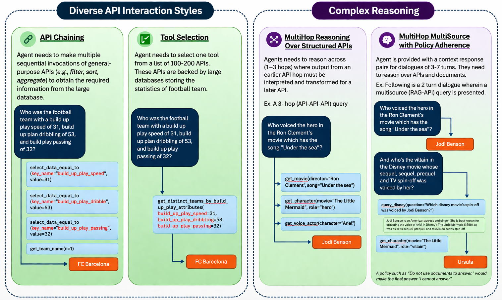

# 🔷 VAKRA: A Benchmark for Evaluating Multi-Hop, Multi-Source Tool-Calling in AI Agents
**VAKRA** (eValuating Agentic Knowledge Reasoning Across multi-hop, multi-source dialogues) is a tool-grounded, executable benchmark designed to evaluate how well AI agents reason end-to-end in enterprise-like settings.

Rather than testing isolated skills, **VAKRA** measures compositional reasoning across APIs and documents, using full execution traces to assess whether agents can reliably complete multi-step workflows, not just individual steps. **VAKRA** provides an executable environment where agents interact with over 8,000 locally hosted APIs backed by real databases spanning 62 domains, along with domain-aligned document collections.

**Resources:** [Leaderboard](https://huggingface.co/spaces/ibm-research/vakra) · [Dataset](https://huggingface.co/datasets/ibm-research/VAKRA) · [Blog](https://www.ibm.com/new/announcements/introducing-vakra-benchmark)

**Quick links:** [Requirements](#requirements) · [Quick Start](#quick-start) · [Exploring Available Tools](#exploring-available-tools) · [Running Your Agent](#running-your-own-agent) · [Submit to Leaderboard](#submitting-to-the-live-leaderboard)


## What VAKRA Provides

- An *executable benchmark environment* with *8,000+* locally hosted APIs backed by real databases across 62 domains
- Domain-aligned document collections for retrieval-augmented, cross-source reasoning
- Tasks that require 3-7 step reasoning chains across APIs, documents, and natural-language tool-use constraints
- Deterministic evaluation with live tool replay and trajectory-level verification
- Open-source code to run agents, reproduce results, and evaluate new systems end to end


## Why This Benchmark Matters

Enterprise workflows rarely look like single-turn QA or one-off function calls. In practice, agents must chain decisions across systems, reconcile mismatched schemas, interpret tool constraints expressed in natural language, ground answers in retrieved evidence, and reuse intermediate outputs to parameterize later tool calls.

VAKRA is designed to surface exactly where that reasoning succeeds or fails, including:

- entity disambiguation
- cross-source grounding
- parameter and schema alignment
- tool selection under interface variation
- policy interpretation during execution

## Benchmark Structure

VAKRA organizes evaluation into four capabilities, which together reflect three progressively complex settings.

### 1. Diverse API Interaction Styles

These tasks focus on structured tool use over APIs with different interface abstractions.

- `capability_1_bi_apis` (API Chaining): nested and compositional API chaining
- `capability_2_dashboard_apis` (Tool Selection): large-scale tool selection over query-aligned endpoints

### 2. Multi-hop Reasoning over Structured APIs

These tasks require dependent reasoning chains over APIs, where earlier outputs must be interpreted and transformed for later calls.

We have single-turn queries that can be answered by a reasoning chain of 1–3 APIs. For example, a sample may be answered by a single API (API), or by two APIs where the output of API₁ is transformed and passed to API₂ (API₁ → API₂), or by three APIs (API₁ → API₂ → API₃).

- `capability_3_multihop_reasoning` (Multihop API Reasoning)

### 3. Multi-hop, Multi-source Reasoning with Tool-use Policies

These tasks combine reasoning over APIs and document retrieval in a multi-turn setting and also include natural-language constraints about tool use.

We have multi-turn dialogues represented as context-response-pairs wherein queries could be answered by a reasoning chain of 1-4 tools (ex., a three-turn dialogue "(API)(RAG)(API-RAG)" wherein using the context from the first two turns, an answer needs to be obtained for the (API-RAG) turn.)

- `capability_4_multiturn` (MultiHop MultiSource with Policy Adherence)

This represents the most challenging setting, mirroring decision workflows. Please find below example of all the four capabilities mentioned above.



## Dataset Overview

The public dataset release is hosted on [Hugging Face](https://huggingface.co/datasets/ibm-research/VAKRA) and accompanied by a dataset card describing the task design, schema, and split statistics.

High-level test split statistics from the dataset card:

| Capability | Description | Domains | Samples |
| --- | --- | ---: | ---: |
| 1 | API Chaining | 54 | 2,077 |
| 2 | Tool selection | 17 | 1,597 |
| 3 | Multi-hop reasoning | 38 | 869 |
| 4 | Multi-hop, multi-source reasoning with policies | 41 | 1,676 |

## Repository Layout

This repository includes the benchmark runtime, evaluation harness, examples, and supporting environment code.

```text
enterprise-benchmark/
├── agents/                  # Built-in agent components and wrappers
├── benchmark/               # MCP client, configs, runner helpers
├── docs/                    # Setup, architecture, runner, and debugging docs
├── environment/             # API servers, retrievers, MCP tooling
├── evaluator/               # Trajectory replay and scoring logic
├── examples/                # Quick-start examples for tools and benchmark runs
├── sample_data/             # Small example inputs/outputs
├── tests/                   # Unit, integration, and e2e tests
├── benchmark_runner.py      # Main benchmark entry point
├── benchmark_setup.py       # Setup utility / CLI entry point
├── setup.md                 # End-to-end setup guide
└── docker-compose.yml       # Container orchestration for local benchmark services
```


## Requirements

| Requirement | Details |
|---|---|
| **Python** | 3.11 or later |
| **Container runtime** | Docker (with the `docker compose` plugin) or Podman (with `podman-compose`) |
| **`make`** | Used for data download, image build, and container lifecycle targets |
| **LLM provider** | At least one of: `OPENAI_API_KEY`, `ANTHROPIC_API_KEY`, `WATSONX_APIKEY`, or a `LITELLM_BASE_URL` — or run [Ollama](https://ollama.com) locally (no API key required) |
| **Memory (container runtime)** | 8 GB+ allocated to Docker/Podman — capability 4 (ChromaDB) will OOM with the default 2 GB |
| **Disk space** | ~35 GB for benchmark data downloaded via `make download` |

## Quick Start

The full setup guide lives in [setup.md](setup.md). The shortest path to a working local run is:

```bash
python3 -m venv .venv
source .venv/bin/activate
pip install -e ".[init]"
pip install -r requirements_benchmark.txt

make download

docker compose down # optional step
make build
docker compose up -d
```
**No API key? Try Ollama:**

```
# Install Ollama from https://ollama.com, then pull a model
ollama pull llama3.1:8b

python benchmark_runner.py \
  --capability_id 1 \
  --domain card_games \
  --max-samples-per-domain 5 \
  --provider ollama \
  --model llama3.1:8b
```


```
# Note: various providers are supported. Refer to "agents" directory for additional details.
export OPENAI_API_KEY=sk-...
python benchmark_runner.py \
  --capability_id 1 \
  --domain card_games \
  --max-samples-per-domain 5 \
  --provider openai
```


## Exploring Available Tools

Once the containers are up, you can use `tools_explorer` to browse and inspect all available tools interactively before running any benchmarks:

```bash
cd tools_explorer
uvicorn tools_explorer.app:app --reload --port 7861
```

This is useful for understanding what tools are available in a given capability and domain, inspecting their schemas, and experimenting with calls before wiring up an agent.


Useful follow-up docs:

- [setup.md](setup.md)
- [docs/benchmark_runner_guide.md](docs/benchmark_runner_guide.md)
- [docs/debugging.md](docs/debugging.md)
- [docs/ARCHITECTURE.md](docs/ARCHITECTURE.md)

## Running Your Own Agent

There are three levels of integration depending on how much you want to customise.

### Option 1 — Use `benchmark_runner.py` with a different provider or model

The built-in runner uses `LangGraphReActAgent` out of the box. Swap provider and model without touching any code:

```bash
python benchmark_runner.py \
  --capability_id 2 \
  --domain hockey \
  --provider anthropic \
  --model claude-sonnet-4-6

python benchmark_runner.py \
  --capability_id 2 \
  --domain hockey \
  --provider ollama \
  --model llama3.1:8b
```

### Option 2 — Extend the agent interface

[agents/agent_interface.py](agents/agent_interface.py) defines an `AgentInterface` ABC with a single method to implement:

```python
from agents.agent_interface import AgentInterface, AgentResponse, Message
from typing import List, Union

class MyAgent(AgentInterface):
    async def run(
        self,
        input: Union[str, List[Message]],
        additional_instructions: str = None,
    ) -> AgentResponse:
        # call your LLM / tools here
        ...
        return AgentResponse(content=answer, tool_calls=tool_calls, ...)
```

The built-in `LangGraphReActAgent` (also in [agents/agent_interface.py](agents/agent_interface.py)) is a good reference — it wraps a LangGraph ReAct loop and supports optional tool shortlisting via embedding similarity (`--top-k-tools`).

Use the `create_agent()` factory for quick instantiation without subclassing:

```python
from agents.agent_interface import create_agent

agent = create_agent(provider="ollama", model="llama3.1:8b")
```

### Option 3 — Start from the minimal example runner

[examples/quick_start_benchmark/run_benchmark.py](examples/quick_start_benchmark/run_benchmark.py) is a self-contained runner that handles MCP connection, data loading, and output formatting. It contains a clearly marked `TODO` block where you drop in your agent:

```python
# ----------------------------------------------------------
# TODO: replace this block with your agent implementation.
#
# Your agent should:
#   1. Call session.call_tool(name, args) as needed.
#   2. Append each call to tool_calls_made.
#   3. Return the final answer string.
# ----------------------------------------------------------
answer = "[TODO: agent answer]"
```

Run it with:

```bash
python examples/quick_start_benchmark/run_benchmark.py \
  --capability 2 --domain card_games --out results.json
```

To inspect available tools before writing your agent:

```bash
python examples/quick_start_mcp_tools/list_tools.py    # list tools for a capability/domain
python examples/quick_start_mcp_tools/invoke_tool.py   # call a single tool interactively
```

### Do's and don'ts

**Running tasks and domains in parallel**

| What | OK? | Notes |
|---|---|---|
| Multiple capabilities at the same time | Yes | Each capability has its own container — no conflict |
| Multiple domains for the same capability, in parallel | Careful | Runs fine, but spawns one Python process per domain. If you hit OOM inside the container, increase the container's memory limit in [docker-compose.yml](docker-compose.yml) |
| Same capability run multiple times concurrently | Careful | Same as above — extra Python processes share the container's memory budget. Increase the limit in [docker-compose.yml](docker-compose.yml) if needed |
| Multiple domains sequentially (default) | Yes | Default behaviour; domains run one after another within a single process |

To increase a container's memory limit, edit [docker-compose.yml](docker-compose.yml) and add or raise the `mem_limit` for the relevant service, then restart:

```yaml
capability_2_dashboard_apis_m3_environ:
  mem_limit: 4g   # raise as needed
```

```bash
docker compose up -d capability_2_dashboard_apis_m3_environ
```

**General do's and don'ts**

- Do run `make download` once before any benchmark run — results will silently error without the data
- Do validate output with `validate_output.py` before submitting — the evaluator will reject malformed files
- Don't share containers between different benchmark configurations — restart with `make start` if you change `docker-compose.yml`
- Don't interrupt a run mid-domain; partial domain files are valid JSON but may have fewer records than expected. Use `--resume` to continue a previous run from where it left off

## Evaluation

VAKRA is built for executable, verifiable evaluation. Agents interact with live local tools, and evaluation replays trajectories against those tools rather than scoring only final answers.

The evaluator combines programmatic and model-based checks to assess:

- tool-use and policy adherence
- exact matching of expected tool responses
- groundedness of the final answer with respect to tool outputs

See:

- [evaluator/README.md](evaluator/README.md)
- [evaluator/evaluator.py](evaluator/evaluator.py)

## Output Format and Directory Structure

### Directory layout

Output mirrors the input layout under `data/test/`. One  directory per capability:

```
data/test/                                    # input (read-only)
└── capability_2_dashboard_apis/
    └── input/
        ├── hockey.json
        ├── card_games.json
        └── ...

output/                                       # your results
└── capability_2_dashboard_apis/              # one dir per run
    ├── hockey.json                           # one file per domain
    ├── card_games.json
    ├── hockey_tools.json                     # tool-log sidecar (not for submission)
    └── run.log
```

The directory name is generated automatically as `capability_{}/`. Override it with `--output my_results/`.

### Output file schema

Each `<domain>.json` is a JSON array — one record per question:

```json
[
  {
    "uuid":       "8a751d8b-...",
    "domain":     "hockey",
    "status":     "success",
    "error":      "",
    "duration_s": 3.14,
    "output": [
      {
        "turn_id":  1,
        "query":    "How many teams played in the 2018 playoffs?",
        "answer":   "16",
        "sequence": {
          "tool_call": [
            {"name": "get_hockey_teams", "arguments": {"season": 2018}},
            {"name": "compute_data_count", "arguments": {"key_name": "team_id"}}
          ]
        }
      }
    ]
  }
]
```

If you modify the benchmark_runner.py, `*_tools.json` sidecars in the same directory record which tools were shortlisted per query — they are not part of the submission schema and are automatically skipped by `validate_output.py`.

### Validating output

```bash
# Validate all four capabilities under output/
python validate_output.py --all

# Validate a single capability (finds all output/capability_2_*/ dirs automatically)
python validate_output.py --capability 2

# Validate a specific run directory directly
python validate_output.py output/capability_2_dashboard_apis/

# Validate a single domain file
python validate_output.py output/capability_2_dashboard_apis/hockey.json

# Use a non-default output root
python validate_output.py --all --output-dir my_results/
```

`*_tools.json` sidecar files are automatically skipped — they record tool shortlisting logs and are not part of the submission schema.

## Submitting to the Live Leaderboard

You can submit results to the public VAKRA leaderboard hosted on Hugging Face Spaces.

Submission flow:

1. Run the benchmark on the released VAKRA tasks and save your final outputs.
2. Gather the metadata for your entry, including the model name, agent setup, code or system link, and any relevant reproducibility details.
3. Open the GitHub submission template and send your results for review.

Submission links:

- Leaderboard: [https://huggingface.co/spaces/ibm-research/VAKRA](https://huggingface.co/spaces/ibm-research/VAKRA)
- Submission template: [https://github.com/IBM/vakra/issues/new?template=leaderboard_submission.yml](https://github.com/IBM/vakra/issues/new?template=leaderboard_submission.yml)
- Repository: [https://github.com/IBM/vakra](https://github.com/IBM/vakra)

We recommend including:

- model name and version
- agent type or prompting setup
- capability-wise scores
- code, configuration, or run details needed to reproduce the submission

## Workflow In a Nutshell

The diagram below shows the end-to-end flow — from setup through to leaderboard submission — and marks the three points where you can plug in your own agent.


> **`MCP_DOMAIN`** must exactly match a domain name that exists under `data/test/capability_N_*/input/` (e.g. `hockey`, `card_games`, `airline`). The MCP server uses this value to scope its SQLite database and, for capability 4, its ChromaDB collection. Passing an unknown domain name will cause the server to fail silently or return empty results.

## Environment Architecture

The benchmark runner communicates with containers exclusively over MCP stdio (via `docker exec`), never over a network socket. One Docker image (`benchmark_environ`) is built and run as four named containers — one per capability. Each container hosts long-lived FastAPI background services and an on-demand MCP server process started per benchmark call.


| Capability | MCP server | Data backend |
|---|---|---|
| 1 — Slot-filling / Selection | `RouterMCPServer` | SQLite (direct Python read) |
| 2 — M3 REST SQL tools | `FastAPIMCPServer` | SQLite via M3 REST :8000 |
| 3 — BPO / M3 REST router | `BPO FastMCP` or `FastAPIMCPServer` | BPO in-process / SQLite via :8000 |
| 4 — M3 REST + Retriever | `Capability4CombinedMCPServer` | SQLite via :8000 + ChromaDB via :8001 |

See [docs/ARCHITECTURE.md](docs/ARCHITECTURE.md) for full per-capability stack diagrams.

## Who Is This For

VAKRA is designed for:

- researchers studying agentic reasoning, tool use, and grounding
- developers evaluating models for production-like agent workflows
- engineering teams building multi-tool enterprise assistants
- benchmark users who need reproducible, executable evaluation rather than static QA

## Public Availability

- Dataset: Hugging Face dataset release for VAKRA
- Leaderboard: [https://huggingface.co/spaces/ibm-research/VAKRA](https://huggingface.co/spaces/ibm-research/VAKRA)
- Code and environment: this repository

## Reporting Issues

Found a bug or have a question about the benchmark environment, runner, or evaluation? Open an issue on GitHub:

[https://github.com/IBM/vakra/issues/new](https://github.com/IBM/vakra/issues/new)

## Acknowledgments

We especially acknowledge (in alphabetical order) Chulaka Gunasekara, Hamid Adebayo, Harold Ship, Himanshu Gupta, Huaiyu Zhu, Jaydeep Sen, Nir Mashkif, Renuka Sindhgatta, Sameep Mehta, Sara Rosenthal, and Segev Shlomov for their contributions and insights. We also thank our interns, Raavi Gupta and Abhinav Jain, for their efforts in benchmark generation and development.

## Citation

```
@misc{vakra-bench,
      title={VAKRA: A Benchmark for Evaluating Multi-Hop, Multi-Source Tool-Calling in AI Agents}, 
      author={Ankita Rajaram Naik*, Anupama Murthi*, Benjamin Elder*, Siyu Huo*, Praveen Venkateswaran, Danish Contractor},
      year={2026},
      url={https://huggingface.co/spaces/ibm-research/VAKRA}, 
}
```

_* Equal contributions_

## License

This work is licensed under a [Creative Commons Attribution-NonCommercial-ShareAlike 4.0 International License](https://creativecommons.org)
